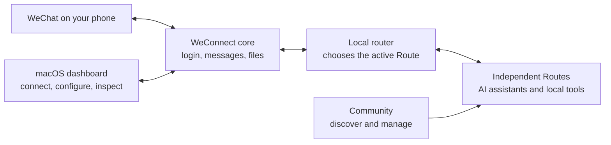

# WeConnect

[简体中文](./README.zh_CN.md)

**Turn one WeChat chat into a command center for the tools on your Mac.**

WeConnect (the app in this `wechat2all` repository) connects a WeChat chat to
local AI assistants and workflows. Scan once, send a message from your phone,
and WeConnect routes it to the tool you choose. Replies, images, and files come
back through the same chat.

It is a local-first, community-powered router rather than one fixed desktop
agent. The core handles WeChat, routing, local state, and the desktop dashboard;
each capability is an independent **Route**. Choose only the Routes you want
from Community, remove them when you no longer need them, or build and publish
your own.

> WeConnect is under active development. The current build targets macOS and is
> run from source.

<p align="center">
  
</p>

## A Router, Not a Fixed Agent

Most desktop agents ship as one assistant with a fixed set of integrations.
WeConnect separates the communication layer from the tools behind it:

| A fixed desktop agent | WeConnect |
|---|---|
| One predefined set of abilities | Pick the Routes that fit your own workflow |
| Integrations are bundled into the main app | Routes install, update, and uninstall independently |
| Extending it usually means changing the core | Anyone can build a Route with the public Route Protocol |
| New integrations depend on one product team | Community can publish reusable Routes for everyone |

Community is therefore more than a list of demos. It is the distribution layer
for optional Routes: users can review what a Route does, what it requires, and
which permissions it requests before installing it. The result is one WeChat
entry point that can grow with different users without turning the core app
into a collection of hard-coded agents.

## What You Can Do

- Connect a WeChat chat by scanning a QR code.
- Choose, install, update, and remove Routes through Community.
- Talk to the default assistant or switch between the Routes you selected.
- Create a Route for your own agent, app, API, or local workflow.
- Send text, images, and files between WeChat and supported local tools.
- See connection status, Routes, configuration, and traces in one desktop app.
- Keep login state, memory, and attachment caches on your own Mac by default.

## How to Use

### 1. Install and open WeConnect

On a Mac, clone the repository and run the onboarding script:

```bash
git clone https://github.com/WillbsoluteVodka/wechat2all.git
cd wechat2all
./onboard.sh
```

The script checks and prepares Xcode Command Line Tools, Homebrew, Git, Node.js,
pnpm, Rust, and the project dependencies. When everything is ready, it opens
the WeConnect desktop app.

Useful alternatives:

```bash
./onboard.sh --check       # check only
./onboard.sh --no-launch   # prepare everything without opening the app
```

See [onboard.md](./onboard.md) for manual setup and troubleshooting.

### 2. Configure and connect

1. Open **Config** and choose an OpenAI-compatible model, such as DeepSeek or
   OpenAI.
2. Enter your own API key and save.
3. Scan the WeChat QR code shown by WeConnect.
4. Open the new chat in WeChat and send `/help`.

Secrets and sessions are stored locally and are not committed to Git.

### 3. Choose your Routes

Open **Community** in the desktop app to browse available Routes. Review each
Route's description, requirements, and requested permissions, then install only
the ones that match your workflow. Community also handles updates and removal
without adding that Route's business logic to the WeConnect core.

### 4. Switch Routes from WeChat

```text
/help          show available commands
/ls            list available Routes
/cd <route>    enter a Route
/cd ..         return to the main assistant
```

Once you enter a Route, normal messages go to that Route until you return with
`/cd ..`. Route-specific setup and commands live in that Route's own README.

## How It Works



WeConnect core owns the WeChat connection, message normalization, local state,
Route selection, and desktop control surface. Route packages own their own
tool-specific behavior and dependencies. Community connects the two without
making any individual Route a permanent part of the core.

## For Developers

### Develop the core app

Requirements: macOS, Node.js 20.19+ or 22.12+, pnpm 9+, Rust stable, and Xcode
Command Line Tools.

```bash
pnpm install --frozen-lockfile
pnpm check
pnpm desktop
```

The main packages are:

| Package | Purpose |
|---|---|
| [`packages/client`](./packages/client) | WeChat login, polling, sending, and media transport |
| [`packages/runtime`](./packages/runtime) | Messages, actions, local memory, and Route selection |
| [`packages/router-daemon`](./packages/router-daemon) | Local process, profile state, HTTP API, and Community management |
| [`packages/desktop`](./packages/desktop) | React + Tauri macOS dashboard |
| [`packages/route-sdk`](./packages/route-sdk) | Public contract and tooling for independent Routes |

Route integrations are intentionally kept in independent packages. Their
implementation details belong in their package or repository documentation,
not in this core README.

### Build a Route

Routes use **WeConnect Route Protocol v1**. A Route can receive normalized
messages, return standard actions, expose setup checks and configuration, and
declare its capabilities and permissions before installation.

A Route can connect almost anything that can be expressed as a local or remote
workflow: an AI agent, a desktop app, an HTTP API, a command-line tool, or a
private tool made only for your own setup.

1. Copy the
   [`route-package` template](./packages/route-sdk/templates/route-package).
2. Rename the package and edit `weconnect.route.json`.
3. Export a `routePackage` whose manifest matches the JSON manifest.
4. Build and test it, then load the built entrypoint with
   `WECHAT2ALL_ROUTE_PACKAGES`.
5. Publish the Route as its own package/repository and add a reviewed Community
   catalog entry when it is ready for distribution.

Start with the [Route SDK guide](./packages/route-sdk/README.md), the
[minimal example](./packages/route-sdk/examples/echo-route.ts), and the full
[protocol reference](./packages/route-sdk/PROTOCOL.md).

### Contribute

- Open an issue before a large behavioral or protocol change.
- Keep core behavior in the package that owns it; keep tool-specific behavior
  inside a Route.
- Update tests and documentation together with behavior.
- Run `pnpm check` before opening a pull request.
- Never commit `.env.local`, API keys, WeChat credentials, sessions, or runtime
  state.

## Local Data and Privacy

Private runtime data is stored under `~/.wechat2all-runtime-bot` by default,
including WeChat credentials, message cursors, local memory, Route state, and
cached attachments. These paths are excluded from Git.

Messages leave your Mac only when required by the service you configured—for
example, the main LLM provider or a Route's own remote API. Review a Route's
declared permissions before installing it.
