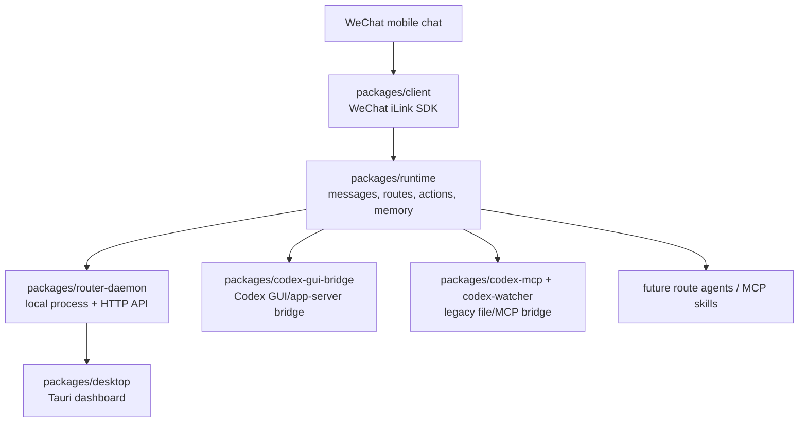

# wechat2all

[简体中文](./README.zh_CN.md)

wechat2all is a local-first WeChat gateway for bots, agents, skills, and
desktop automations. The current target is a macOS app that lets one scanned
WeChat chat act like a local control surface: the main assistant is the OS-like
router, and each route is an app/agent you can enter, leave, and connect to
local services.

## Project Map



## Layers And Boundaries

Each package owns one layer and should stay independently understandable.

| Layer | Package | Owns | Does not own |
|---|---|---|---|
| Protocol SDK | `packages/client` | WeChat iLink login, polling, media upload/download, send APIs | Route selection, LLMs, memory, UI |
| Runtime | `packages/runtime` | `WeixinMessage -> RuntimeMessage`, route matching, connectors, memory, action execution | HTTP server, QR dashboard, desktop app |
| Local daemon | `packages/router-daemon` | Process lifecycle, profile state, QR login API, dashboard HTTP API, built-in routes | UI rendering, low-level iLink protocol |
| Desktop UI | `packages/desktop` | macOS Tauri dashboard, QR/login/status/routes/logs/settings screens | Runtime business logic |
| Codex GUI bridge | `packages/codex-gui-bridge` | Codex app-server chat listing, binding, token usage, prompt delivery | WeChat routing or generic MCP tools |
| Codex file bridge | `packages/codex-mcp`, `packages/codex-watcher` | Legacy file/MCP bridge for Codex route experiments | Current preferred GUI chat delivery |

Example flow:

1. A user sends `hello` in the WeChat bot chat.
2. `client` receives the raw iLink message and exposes it as a `WeixinMessage`.
3. `runtime` normalizes it into `RuntimeMessage`, checks the current route, and
   asks the matched connector for `RuntimeAction`s.
4. `router-daemon` owns the running profile and trace stream.
5. `client` executes the returned action, such as `send_text`, back to WeChat.

Route navigation currently behaves like a tiny local OS:

```text
/help        # main assistant commands
/ls          # visible routes
/rename      # rename the current route
/cd codex    # enter the codex route
/cd ..       # return to the main assistant
```

Inside a second-level route, the main assistant stops listening until the user
returns with `/cd ..`.

## Current Features

- One physical WeChat scan/profile with multiple logical routes.
- Main assistant route (`大助手`) for general LLM chat, route listing, renaming,
  and route switching.
- Codex route with `/ls`, `/bind <threadId>`, `/current`, `/token`, and prompt
  delivery into a bound Codex GUI chat.
- Standard runtime action surface: `send_text`, `send_media`, `send_voice`,
  `typing`, and `noop`.
- Message normalization for text, media, voice, emoji/sticker-like attachments,
  and generic files when the iLink payload contains the needed metadata.
- Local JSONL memory plus optional Mem0 agent memory provider.
- Dummy TTS provider as a placeholder for future real voice replies.
- Tauri dashboard for QR login, routes, agents/MCP, logs/traces, memory, and
  settings.

## Tech Stack

- TypeScript monorepo with `pnpm` workspaces.
- Node.js 20+ runtime.
- `tsdown` for package builds.
- Node test runner plus `tsx` for TypeScript tests/probes.
- WeChat iLink/OpenClaw-compatible HTTP protocol in `packages/client`.
- React + Vite + Tauri v2 for the macOS dashboard.
- Rust only for the Tauri shell.
- OpenAI-compatible LLM provider configuration; DeepSeek works through the same
  interface.
- Local JSONL memory and optional Mem0 REST memory.
- Codex app-server JSON-RPC plus opt-in macOS GUI automation for visible Codex
  chat injection.

## Setup

```bash
pnpm install
pnpm check
```

Use `.env.local` at the repo root for local keys and settings. Do not commit
real API keys.

Common LLM settings:

```bash
WECHAT2ALL_LLM_PROVIDER=openai-compatible
WECHAT2ALL_LLM_BASE_URL=https://api.deepseek.com/v1
WECHAT2ALL_LLM_API_KEY=...
WECHAT2ALL_LLM_MODEL=deepseek-chat
WECHAT2ALL_LLM_TEMPERATURE=0.7
WECHAT2ALL_LLM_MAX_TOKENS=800
```

Optional memory:

```bash
WECHAT2ALL_MEM0_API_KEY=...
```

## Run

Low-level SDK echo bot:

```bash
pnpm echo-bot
```

Runtime bot without the desktop dashboard:

```bash
pnpm runtime-bot
pnpm runtime-bot -- --profile main --fresh
```

Full local dashboard stack:

```bash
pnpm desktop
```

Use Codex GUI delivery:

```bash
WECHAT2ALL_CODEX_BACKEND=gui-app-server \
WECHAT2ALL_CODEX_DELIVERY=gui-automation \
pnpm desktop
```

If port `39787` is already occupied, another router daemon or desktop session is
already running. Stop it, or point this run at a different local port:

```bash
WECHAT2ALL_ROUTER_PORT=39788 pnpm desktop
```

## macOS Privacy Settings

For normal QR login and dashboard viewing, no special macOS permission should be
needed beyond network access.

For Codex GUI delivery with `WECHAT2ALL_CODEX_DELIVERY=gui-automation`, macOS
must allow the process running wechat2all to control the computer:

1. Open System Settings.
2. Go to Privacy & Security -> Accessibility.
3. Enable the app or terminal you use to start wechat2all. Common entries:
   `Terminal`, `iTerm`, `Codex`, and sometimes `Codex Computer Use`.
4. Keep the Codex desktop app installed and logged in.

The GUI delivery path opens `codex://threads/<threadId>`, waits briefly, pastes
the prompt into that bound chat, presses Enter, then polls the same thread for a
final answer.

## Current Progress For Collaborators

- `packages/client` is the robust low-level SDK. Keep it stateless.
- `packages/runtime` is the primary product logic layer. Add new route behavior,
  memory policies, connectors, and action abstractions here.
- `packages/router-daemon` is the local app backend. It should wire runtime to
  QR login, HTTP endpoints, traces, and desktop state, but not absorb runtime
  business logic.
- `packages/desktop` is a usable development dashboard, not yet a packaged
  installer.
- `packages/codex-gui-bridge` is the current preferred Codex integration. The
  file watcher/MCP packages remain for compatibility and experiments.

Before changing behavior, read the README in the package you are touching.
