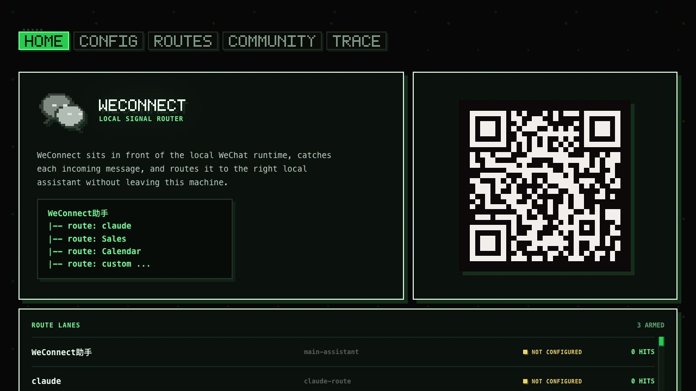
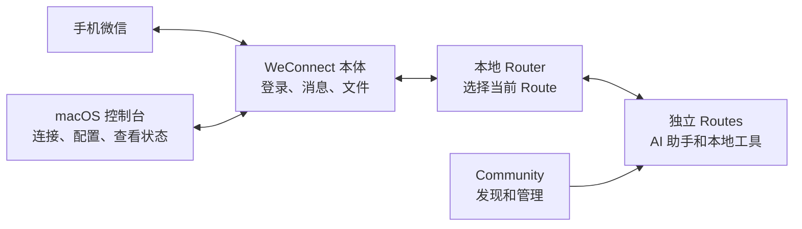

# WeConnect

[English](./README.md)

**用一个微信聊天窗口，控制 Mac 上的不同工具。**

WeConnect（本仓库 `wechat2all` 中的应用）把一个微信聊天连接到本机的 AI 助手和
工作流。扫码连接后，你只需要在手机上发消息，WeConnect 就会把消息交给你选择的
工具，并把文字、图片或文件通过同一个聊天发回来。

它不是一个能力固定的桌面 Agent，而是一个 local-first、由 Community 扩展的 Router。
本体只负责微信连接、消息路由、本地状态和桌面控制台；每种能力都是独立的
**Route**。你可以从 Community 里只选择自己需要的 Routes，不需要时随时移除，也
可以开发并发布自己的 Route。

> WeConnect 仍在积极开发中。当前版本面向 macOS，并通过源码运行。

<p align="center">
  
</p>

## 它不是一个能力固定的桌面 Agent

大多数桌面 Agent 是“一个助手加一组预先决定的集成”。WeConnect 把通信入口和背后的
工具拆开：

| 能力固定的桌面 Agent | WeConnect |
|---|---|
| 使用预先决定的一组能力 | 根据自己的工作流自由选择 Routes |
| 所有集成都打包进主应用 | 每个 Route 都能独立安装、更新和卸载 |
| 扩展能力通常需要修改本体 | 任何人都能通过公开 Route Protocol 开发新 Route |
| 新集成依赖单一产品团队 | Community 可以为所有用户发布可复用 Routes |

所以 Community 不只是一个 demo 列表，而是可选 Routes 的分发层。安装前，用户可以
查看 Route 能做什么、需要什么环境、会申请哪些权限。这样，同一个微信入口可以跟着
不同用户的需求自由生长，同时避免让 WeConnect 本体变成一堆写死的 Agents。

## 它能做什么

- 扫描二维码，把一个微信聊天连接到 WeConnect。
- 通过 Community 选择、安装、更新和移除 Routes。
- 和默认助手聊天，或在自己选择的 Routes 之间随时切换。
- 为自己的 Agent、App、API 或本地工作流开发 Route。
- 在微信与支持的本地工具之间传递文字、图片和文件。
- 在一个桌面应用里查看连接状态、Routes、配置和运行记录。
- 默认把登录状态、memory 和附件缓存保存在自己的 Mac 上。

## 如何使用

### 1. 安装并打开 WeConnect

在 Mac 上 clone 仓库，然后运行 onboarding 脚本：

```bash
git clone https://github.com/WillbsoluteVodka/wechat2all.git
cd wechat2all
./onboard.sh
```

脚本会检查并准备 Xcode Command Line Tools、Homebrew、Git、Node.js、pnpm、Rust
和项目依赖。环境就绪后，它会直接打开 WeConnect 桌面应用。

也可以只检查或只安装：

```bash
./onboard.sh --check       # 只检查
./onboard.sh --no-launch   # 准备环境，但不打开应用
```

手动安装步骤和常见问题见 [onboard.md](./onboard.md)。

### 2. 配置并连接微信

1. 打开 **Config**，确认选择 DeepSeek 或 OpenAI（首次启动默认选择 DeepSeek）。
2. 填入你自己的 API key 并保存。
3. 按页面提示重启 WeConnect，使 daemon 和所有 Routes 读取同一份配置。
4. 扫描 WeConnect 显示的微信二维码。
5. 在微信里打开新聊天，发送 `/help`。

API key 和登录 session 只保存在本机，不会提交到 Git。

### 3. 选择需要的 Routes

打开桌面应用里的 **Community**，浏览当前可用的 Routes。查看每个 Route 的介绍、
环境要求和申请的权限，只安装适合自己工作流的部分。Community 也负责更新和卸载，
不需要把某个 Route 的业务代码加入 WeConnect 本体。

### 4. 在微信里切换 Route

```text
/help          查看可用命令
/ls            查看可用 Routes
/cd <route>    进入一个 Route
/cd ..         回到默认助手
```

进入某个 Route 后，普通消息会一直交给它处理，直到你用 `/cd ..` 返回。每个 Route
自己的配置方法和命令由它自己的 README 说明。

## 工作方式



WeConnect 本体负责微信连接、消息标准化、本地状态、Route 切换和桌面控制台。每个
Route 只负责自己的工具逻辑和专属依赖。Community 把两者连接起来，但不会让任何
一个 Route 永久成为本体的一部分。

## 面向开发者

### 开发 WeConnect 本体

开发环境需要 macOS、Node.js 20.19+ 或 22.12+、pnpm 9+、Rust stable 和 Xcode
Command Line Tools。

```bash
pnpm install --frozen-lockfile
pnpm check
pnpm desktop
```

主要 packages：

| Package | 作用 |
|---|---|
| [`packages/client`](./packages/client) | 微信登录、轮询、发送和媒体传输 |
| [`packages/runtime`](./packages/runtime) | 消息、动作、本地 memory 和 Route 选择 |
| [`packages/router-daemon`](./packages/router-daemon) | 本地进程、profile 状态、HTTP API 和 Community 管理 |
| [`packages/desktop`](./packages/desktop) | React + Tauri macOS 控制台 |
| [`packages/route-sdk`](./packages/route-sdk) | 独立 Route 使用的公开协议和工具 |

各种 Route 集成会尽量保持为独立 package。它们的实现细节应该放在各自 package 或
独立仓库的文档中，而不是堆在本体 README 里。

### 新增一个 Route

Route 使用 **WeConnect Route Protocol v1**。它可以接收标准化消息、返回标准动作、
提供配置和环境检查，并在安装前声明能力与权限。

任何可以表达成本地或远端工作流的东西都可以成为 Route：AI Agent、桌面 App、
HTTP API、命令行工具，或者只为你自己的环境开发的私有工具。

1. 复制 [`route-package` 模板](./packages/route-sdk/templates/route-package)。
2. 修改 package 名称和 `weconnect.route.json`。
3. 导出 `routePackage`，并保持代码中的 manifest 与 JSON manifest 一致。
4. build 和测试后，通过 `WECHAT2ALL_ROUTE_PACKAGES` 加载构建产物。
5. 准备发布时，把 Route 放在自己的 package/repository 中，再添加经过审核的
   Community catalog 条目。

建议从 [Route SDK 指南](./packages/route-sdk/README.md)、
[最小示例](./packages/route-sdk/examples/echo-route.ts)和
[完整协议](./packages/route-sdk/PROTOCOL.md)开始。

### 参与贡献

- 大型行为或协议改动前，先开 issue 讨论。
- 本体能力放在负责它的 core package；工具专属能力放进独立 Route。
- 行为、测试和文档一起更新。
- 提交 pull request 前运行 `pnpm check`。
- 不要提交 `.env.local`、API key、微信 credentials、session 或 runtime state。

## 本地数据与隐私

私有运行数据默认保存在 `~/.wechat2all-runtime-bot`，包括微信登录凭据、消息 cursor、
本地 memory、Route 状态和附件缓存。这些路径都已从 Git 中排除。

只有你配置的服务确实需要时，消息才会离开本机，例如默认助手使用的 LLM provider，
或者某个 Route 自己调用的远端 API。安装 Route 前请检查它声明的权限。
