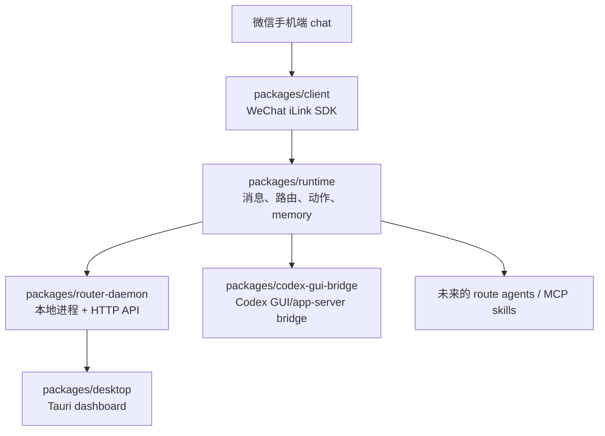

# wechat2all

[English](./README.md)

wechat2all 是一个 local-first 的微信 gateway，用来连接 bots、agents、skills
和本地桌面自动化。当前目标是做成 macOS 本地软件：用户只需要扫码连接一个微信
chat，这个 chat 就像一个本地控制台。`大助手` 是 OS/router，每个 route 是一个
可以进入、退出、连接本地服务的 app/agent。

## 项目结构图



## 每一层的边界

每个 package 只负责自己这一层，后续 collaborator 或 Codex 读文档时也应该按这个
边界理解项目。

| 层级 | Package | 负责 | 不负责 |
|---|---|---|---|
| 协议 SDK | `packages/client` | WeChat iLink 登录、轮询、媒体上传/下载、发消息 API | 路由、LLM、memory、UI |
| Runtime | `packages/runtime` | `WeixinMessage -> RuntimeMessage`、route matching、connectors、memory、动作执行 | HTTP server、QR dashboard、桌面 app |
| 本地 daemon | `packages/router-daemon` | 进程生命周期、profile 状态、QR 登录 API、dashboard HTTP API、内置 routes | UI 渲染、底层 iLink 协议 |
| Desktop UI | `packages/desktop` | macOS Tauri dashboard、QR/login/status/routes/logs/settings 页面 | runtime 业务逻辑 |
| Codex GUI bridge | `packages/codex-gui-bridge` | Codex app-server chat 列表、绑定、token usage、向绑定 GUI chat 发送 prompt | 微信路由或通用 MCP tools |

一个消息的例子：

1. 用户在微信 bot chat 里发送 `hello`。
2. `client` 收到 iLink 原始消息，暴露成 `WeixinMessage`。
3. `runtime` 把它标准化成 `RuntimeMessage`，检查当前 route，然后让匹配的
   connector 生成 `RuntimeAction`。
4. `router-daemon` 负责正在运行的 profile、状态和 trace。
5. `client` 执行动作，比如 `send_text`，把回复发回微信。

当前 route 交互像一个很小的本地 OS：

```text
/help        # 大助手命令
/ls          # 查看可用 routes
/rename      # 重命名当前 route
/cd codex    # 进入 codex route
/cd ..       # 回到大助手
```

进入二级 route 后，大助手不会继续监听普通输入，直到用户 `/cd ..` 返回。

## 当前功能

- 一个真实微信扫码 profile 下挂多个逻辑 routes。
- `大助手` 默认 route：普通 LLM 聊天、route 列表、rename、route 切换。
- Codex route：支持 `/ls`、`/bind <序号>`、`/current`、`/token`，以及把
  普通微信消息发送到绑定的 Codex GUI chat。
- 标准 runtime action：`send_text`、`send_media`、`send_voice`、`typing`、
  `noop`。
- 对文本、媒体、语音、表情/贴纸类附件、普通文件做消息标准化。具体能力取决于
  iLink payload 里是否包含足够 metadata。
- Local JSONL memory，加可选 Mem0 agent memory。
- Dummy TTS provider，给后续真实语音回复预留接口。
- Tauri dashboard：QR 登录、routes、agents/MCP、logs/traces、memory、settings。

## 技术栈

- TypeScript monorepo，使用 `pnpm` workspaces。
- Node.js 20+。
- `tsdown` 负责 package build。
- Node test runner + `tsx` 跑 TypeScript tests/probes。
- `packages/client` 内实现 WeChat iLink/OpenClaw-compatible HTTP protocol。
- React + Vite + Tauri v2 做 macOS dashboard。
- Rust 只用于 Tauri shell。
- OpenAI-compatible LLM provider；DeepSeek 也走同一个接口。
- Local JSONL memory 和可选 Mem0 REST memory。
- Codex app-server JSON-RPC，加 opt-in macOS GUI automation，用来把消息打进可见的
  Codex chat。

## 安装

```bash
pnpm install
pnpm check
```

本地 key 和配置放在 repo 根目录 `.env.local`。不要提交真实 API key。

常用 LLM 配置：

```bash
WECHAT2ALL_LLM_PROVIDER=openai-compatible
WECHAT2ALL_LLM_BASE_URL=https://api.deepseek.com/v1
WECHAT2ALL_LLM_API_KEY=...
WECHAT2ALL_LLM_MODEL=deepseek-chat
WECHAT2ALL_LLM_TEMPERATURE=0.7
WECHAT2ALL_LLM_MAX_TOKENS=800
```

可选 memory：

```bash
WECHAT2ALL_MEM0_API_KEY=...
```

## 启动

底层 SDK echo bot：

```bash
pnpm echo-bot
```

不启动桌面 UI，只跑 runtime bot：

```bash
pnpm runtime-bot
pnpm runtime-bot -- --profile main --fresh
```

完整本地 dashboard：

```bash
pnpm desktop
```

使用可见的 Codex GUI delivery：

```bash
WECHAT2ALL_CODEX_DELIVERY=gui-automation \
pnpm desktop
```

如果 `39787` 被占用，通常是已有 router daemon 或 desktop session 在运行。可以停掉
旧进程，或者换一个本地端口：

```bash
WECHAT2ALL_ROUTER_PORT=39788 pnpm desktop
```

## macOS Privacy 设置

普通 QR 登录和 dashboard 查看通常不需要额外 macOS 权限。

如果使用 `WECHAT2ALL_CODEX_DELIVERY=gui-automation`，macOS 必须允许运行
wechat2all 的 app/terminal 控制电脑：

1. 打开 System Settings。
2. 进入 Privacy & Security -> Accessibility。
3. 打开你用来启动 wechat2all 的 app。常见是 `Terminal`、`iTerm`、`Codex`，
   有时还包括 `Codex Computer Use`。
4. 确认 Codex desktop app 已安装并登录。

GUI delivery 会打开 `codex://threads/<threadId>`，等待一下，向这个绑定 chat 粘贴
prompt，按 Enter，然后轮询同一个 thread 的最终回复。

## 给 collaborator / Codex 的当前进度提示

- `packages/client` 是稳定的底层 SDK。保持无状态。
- `packages/runtime` 是主要产品逻辑层。新 route 行为、memory 策略、connector、
  action 抽象优先放这里。
- `packages/router-daemon` 是本地 app backend。它负责把 runtime 接到 QR 登录、
  HTTP endpoints、trace 和 desktop state，但不要把 runtime 业务逻辑塞进去。
- `packages/desktop` 是可用的开发 dashboard，还不是正式 installer。
- `packages/codex-gui-bridge` 是 Codex 集成方式。旧的 `codex exec` watcher 已经移除。

改某一层之前，先读对应 package 里的 README。
