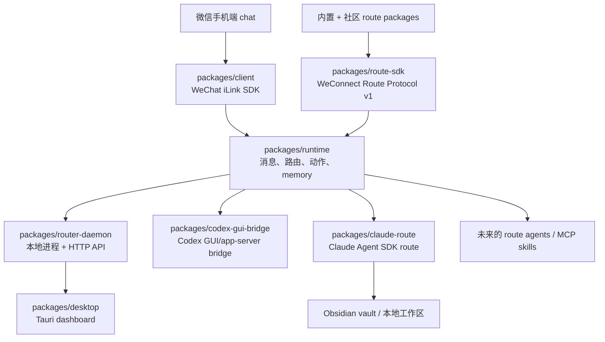

# wechat2all

[English](./README.md)

wechat2all 是一个 local-first 的微信 gateway，用来连接 bots、agents、skills
和本地桌面自动化。当前目标是做成 macOS 本地软件：用户只需要扫码连接一个微信
chat，这个 chat 就像一个本地控制台。`大助手` 是 OS/router，每个 route 是一个
可以进入、退出、连接本地服务的 app/agent。

## 项目结构图



## 每一层的边界

每个 package 只负责自己这一层，后续 collaborator 或 Codex 读文档时也应该按这个
边界理解项目。

| 层级 | Package | 负责 | 不负责 |
|---|---|---|---|
| 协议 SDK | `packages/client` | WeChat iLink 登录、轮询、媒体上传/下载、发消息 API | 路由、LLM、memory、UI |
| Runtime | `packages/runtime` | `WeixinMessage -> RuntimeMessage`、route matching、connectors、memory、动作执行 | HTTP server、QR dashboard、桌面 app |
| Route SDK | `packages/route-sdk` | 带版本的 route manifest、factory、运行时校验、能力/权限声明、生命周期 | 社区商店托管、具体 route 业务逻辑 |
| 本地 daemon | `packages/router-daemon` | 进程生命周期、profile 状态、QR 登录 API、dashboard HTTP API、内置 routes | UI 渲染、底层 iLink 协议 |
| Desktop UI | `packages/desktop` | macOS Tauri dashboard、QR/login/status/routes/logs/settings 页面 | runtime 业务逻辑 |
| Codex GUI bridge | `packages/codex-gui-bridge` | Codex app-server chat 列表、绑定、token usage、向绑定 GUI chat 发送 prompt | 微信路由或通用 MCP tools |
| Claude route | `packages/claude-route` | Claude Agent SDK、session resume、vault/workspace tools、附件暂存 | QR 登录、iLink 协议、daemon 生命周期、desktop UI |

Codex 和 Claude 现在都通过同一个 `WeConnect Route Protocol v1` 加载，社区
package 也走完全相同的入口。第三方开发者只需导出 `routePackage`、随包发布
`weconnect.route.json`，再通过 `WECHAT2ALL_ROUTE_PACKAGES` 安装加载，不需要修改
daemon 源码。完整协议见
[`packages/route-sdk/PROTOCOL.md`](./packages/route-sdk/PROTOCOL.md)，可直接复制的项目
见 [`route-package` template](./packages/route-sdk/templates/route-package)。

一个消息的例子：

1. 用户在微信 bot chat 里发送 `hello`。
2. `client` 收到 iLink 原始消息，暴露成 `WeixinMessage`。
3. `runtime` 把它标准化成 `RuntimeMessage`，检查当前 route，然后让匹配的
   connector 生成 `RuntimeAction`。
4. `router-daemon` 负责正在运行的 profile、状态和 trace。
5. `client` 执行动作，比如 `send_text`，把回复发回微信。

当前 route 交互像一个很小的本地 OS：

```text
/help        # 大助手命令
/ls          # 查看可用 routes
/rename      # 重命名当前 route
/cd codex    # 进入 codex route
/cd claude   # 进入 Claude Agent SDK route
/cd ..       # 回到大助手
```

进入二级 route 后，大助手不会继续监听普通输入，直到用户 `/cd ..` 返回。

## 当前功能

- 一个真实微信扫码 profile 下挂多个逻辑 routes。
- `大助手` 默认 route：普通 LLM 聊天、route 列表、rename、route 切换。
- Codex route：支持 `/ls`、`/bind <序号>`、`/current`、`/token`、`/recover`、
  `/autoopen 1|0`、`/alarm <HH:mm>`、`/cache`、`/cache clear`，以及把普通微信
  消息发送到绑定的 Codex GUI chat。
- Codex app-server 连接故障后会自动重建；route watchdog 会释放卡住的请求，避免
  后续微信消息必须通过重启 WeConnect 才能继续使用。
- 微信发来的图片、普通文件、视频、语音可以缓存为本地附件；纯附件会等待同一用户
  的下一条文字要求，再作为一次 Codex 请求发送。多附件按原顺序并发下载。
- Codex 生成的本地文字、图片、文件和支持格式的语音条可以发回微信。
- `/bind` 选择的 Codex chat 会保存在本机，重启 desktop/daemon 后自动恢复。
- 独立 Claude Agent SDK route：可连接 Obsidian vault 或本地 workspace，支持
  `/status`、`/new`、per-sender session resume、图片/文件输入，以及把 workspace
  文件或图片发回微信。
- Community 可选安装 Office CLI route：安装后复用 `WECHAT2ALL_LLM_*` 配置，
  通过受限参数调用独立安装的 OfficeCLI；卸载后 `/cd office` 会从 routes 中消失，
  主程序不包含它的业务源码。
- 标准 runtime action：`send_text`、`send_media`、`send_voice`、`typing`、
  `noop`。
- 对文本、媒体、语音、表情/贴纸类附件、普通文件做消息标准化。具体能力取决于
  iLink payload 里是否包含足够 metadata。
- Local JSONL memory，加可选 Mem0 agent memory。
- Dummy TTS provider，给后续真实语音回复预留接口。
- Tauri dashboard：QR 登录、routes、agents/MCP、logs/traces、memory、settings。

## 技术栈

- TypeScript monorepo，使用 `pnpm` workspaces。
- Node.js 20+。
- `tsdown` 负责 package build。
- Node test runner + `tsx` 跑 TypeScript tests/probes。
- `packages/client` 内实现 WeChat iLink/OpenClaw-compatible HTTP protocol。
- React + Vite + Tauri v2 做 macOS dashboard。
- Rust 只用于 Tauri shell。
- OpenAI-compatible LLM provider；DeepSeek 也走同一个接口。
- Local JSONL memory 和可选 Mem0 REST memory。
- Codex app-server JSON-RPC，加 opt-in macOS GUI automation，用来把消息打进可见的
  Codex chat。
- 官方 Claude Agent SDK，用于 headless `claude` route；不使用 GUI automation，
  也不会再启动一套微信协议 client。

## 安装

首次在 Mac 上运行，推荐使用仓库根目录的一键 onboarding：

```bash
./onboard.sh
```

它会检查并安装主应用所需的 Homebrew、Xcode Command Line Tools、Node.js、pnpm、
Rust/Cargo 和项目依赖，然后自动运行 `pnpm desktop`。脚本不会检查 Codex、Claude
等具体 route 的专属依赖或账号。完整说明见 [`onboard.md`](./onboard.md)。

手动安装项目依赖：

```bash
pnpm install
pnpm check
```

本地 key 和配置放在 repo 根目录 `.env.local`。不要提交真实 API key。

常用 LLM 配置：

```bash
WECHAT2ALL_LLM_PROVIDER=openai-compatible
WECHAT2ALL_LLM_BASE_URL=https://api.deepseek.com/v1
WECHAT2ALL_LLM_API_KEY=...
WECHAT2ALL_LLM_MODEL=deepseek-chat
WECHAT2ALL_LLM_TEMPERATURE=0.7
WECHAT2ALL_LLM_MAX_TOKENS=800
```

可选 memory：

```bash
WECHAT2ALL_MEM0_API_KEY=...
```

可选 Claude route：

```bash
ANTHROPIC_API_KEY=...
WECHAT2ALL_CLAUDE_WORKDIR=/绝对路径/到/obsidian-vault
```

配置后在微信主 Router 发送 `/cd claude`。完整配置见
[`packages/claude-route/README.md`](./packages/claude-route/README.md)，目标 repo 与
协议审计见 [`docs/claude-route-protocol-review.md`](./docs/claude-route-protocol-review.md)。

媒体下载与本地 cache：

```bash
WECHAT2ALL_MEDIA_DOWNLOAD_TIMEOUT_MS=60000
WECHAT2ALL_MEDIA_DOWNLOAD_MAX_RETRIES=3
WECHAT2ALL_MEDIA_DOWNLOAD_RETRY_DELAY_MS=500
WECHAT2ALL_MEDIA_DOWNLOAD_CONCURRENCY=3
WECHAT2ALL_MEDIA_CACHE_TTL_MS=604800000
WECHAT2ALL_MEDIA_CACHE_MAX_BYTES=1073741824
WECHAT2ALL_MEDIA_CACHE_PRUNE_INTERVAL_MS=60000
```

## 本地数据与隐私边界

`packages/client` 本身无状态。desktop/runtime 默认把私有状态放在
`~/.wechat2all-runtime-bot`：

- `credentials.json`：微信登录凭据。
- `sync-buf.json`、`processed-messages.json`：轮询 cursor 和消息去重记录。
- `memory/<profile>/turns.jsonl`：本地 assistant memory。
- `media/<profile>/`：微信附件 cache，默认最多保留 7 天、总计 1 GB。
- `codex-gui-bridge/`：Codex 绑定、auto-open、alarm 等本地设置。
- 默认 profile 使用 `claude-route/`，命名 profile 使用
  `profiles/<profile>/claude-route/`：保存 Claude session ID 和可编辑 route prompt。

runtime 创建的私有目录使用 `0700`，状态、memory 和媒体文件使用 `0600`；这些路径
都不会被 Git 跟踪。Codex 生成的文件保留在 Codex 自己的本地输出目录，直到 Codex
或用户清理。

会按配置离开本机的数据包括：发给大助手 LLM provider 的消息、Claude route 发给
Anthropic 的请求，以及存在 `WECHAT2ALL_MEM0_API_KEY` 时发给 Mem0 的 agent memory。
删除 Mem0 key 后，agent memory 只使用本地 JSONL。

## 启动

底层 SDK echo bot：

```bash
pnpm echo-bot
```

不启动桌面 UI，只跑 runtime bot：

```bash
pnpm runtime-bot
pnpm runtime-bot -- --profile main --fresh
```

完整本地 dashboard：

```bash
pnpm desktop
```

开发模式下，`pnpm desktop` 会先重启本地旧的 wechat2all dev 进程：desktop app
进程、router 端口 `39787`、UI 端口 `5173`，然后再启动一套新的 router-daemon 和
Tauri。在 macOS 上，它也会跑 Codex GUI auto-open 检查；但默认是关闭的，只有你在
`codex` route 里发送 `/autoopen 1` 后，下一次启动才会自动打开 Codex GUI。
如果想恢复复用旧 daemon：

```bash
WECHAT2ALL_DESKTOP_RESTART=0 pnpm desktop
```

如果想彻底跳过 Codex GUI auto-open 检查：

```bash
WECHAT2ALL_DESKTOP_OPEN_CODEX=0 pnpm desktop
```

Codex GUI delivery 现在是默认路径；如需显式配置：

```bash
WECHAT2ALL_CODEX_DELIVERY=gui-automation \
pnpm desktop
```

如果 `39787` 被非 wechat2all 的进程占用，可以换一个本地端口：

```bash
WECHAT2ALL_ROUTER_PORT=39788 pnpm desktop
```

## macOS Privacy 设置

普通 QR 登录和 dashboard 查看通常不需要额外 macOS 权限。

默认的 `WECHAT2ALL_CODEX_DELIVERY=gui-automation` 路径会打开准确绑定的 Codex
chat，粘贴附件和文字并按 Return。app-server 负责观察完成的回复；只有 GUI 注入失败
且没有产生新 turn 时，才由 app-server fallback 投递。

正常路径会控制 GUI，因此需要给实际启动 wechat2all 的 app/terminal 开启 macOS
Accessibility/Automation。`/new` 由 app-server 创建，首条消息完成后自动打开新 chat。

## 给 collaborator / Codex 的当前进度提示

- `packages/client` 是稳定的底层 SDK。保持无状态。
- `packages/runtime` 是主要产品逻辑层。新 route 行为、memory 策略、connector、
  action 抽象优先放这里。
- `packages/router-daemon` 是本地 app backend。它负责把 runtime 接到 QR 登录、
  HTTP endpoints、trace 和 desktop state，但不要把 runtime 业务逻辑塞进去。
- `packages/desktop` 是可用的开发 dashboard，还不是正式 installer。
- `packages/codex-gui-bridge` 是 Codex 集成方式。旧的 `codex exec` watcher 已经移除。

改某一层之前，先读对应 package 里的 README。
