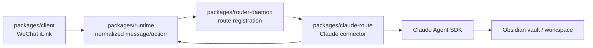

# @wechat2all/claude-route

Independent Claude Agent SDK route for wechat2all. It adapts normalized runtime
messages to one headless Claude run per message while keeping WeChat protocol,
process lifecycle, and desktop UI concerns outside this package.

The design is based on the useful application pattern in
[`WilsonZheng0327/wechat-claude-obsidian-bot`](https://github.com/WilsonZheng0327/wechat-claude-obsidian-bot)
at commit `56fac63d7e357893242a96a12698d477b2775684`. This is a TypeScript
integration for wechat2all rather than a source copy or a second WeChat bot.

## Boundary



- This package owns Claude configuration, Agent SDK options, short-lived session
  continuity, attachment staging, and Claude-facing MCP tools.
- `router-daemon` owns registration and lifecycle.
- `runtime` owns route selection and action execution.
- `client` owns the WeChat protocol. This package does not import or modify it.
- The route does not open a second QR login. It reuses the current wechat2all
  profile and appears as `/cd claude` under the main Router.

## Behavior

- Text and links become a Claude Agent SDK prompt.
- Images and files are downloaded by the runtime media pipeline, size checked,
  and atomically copied into `<workdir>/Wechat_Saved/` before the run.
- Voice uses the transcript supplied by WeChat. Voice without a transcript is
  rejected locally; this package does not download a Whisper model.
- Video is rejected locally.
- Sessions are isolated by profile, conversation, and sender. A fresh session
  ID is resumed for 15 minutes by default, and runs for one sender are serialized.
- The editable route prompt is read for every run. A workspace `CLAUDE.md` is
  loaded through the Agent SDK's project setting source.
- Claude can return workspace files through in-process `send_file` and
  `send_image` MCP tools. Paths are resolved with `realpath` and cannot escape
  the configured workspace.
- If the workspace is already a Git repository, narrowly scoped Git commands
  are enabled. The route never initializes a repository itself.

Local commands do not consume a Claude run:

```text
/status     show route availability, configuration, and session state
/new        clear the current sender's Claude session
/help       show route help
/cd ..      return to the main Router
```

Unknown slash commands intentionally fall through to Claude as ordinary text.

## Configuration

At minimum, configure a workspace and authentication in the repository's local
`.env.local`:

```dotenv
ANTHROPIC_API_KEY=replace-me
WECHAT2ALL_CLAUDE_WORKDIR=/absolute/path/to/your/obsidian-vault
```

Optional settings:

```dotenv
WECHAT2ALL_CLAUDE_MODEL=claude-sonnet-4-5
WECHAT2ALL_CLAUDE_LANGUAGE=zh
WECHAT2ALL_CLAUDE_SESSION_WINDOW_MINUTES=15
WECHAT2ALL_CLAUDE_MAX_MEDIA_MB=50
WECHAT2ALL_CLAUDE_MAX_TURNS=40
WECHAT2ALL_CLAUDE_MAX_BUDGET_USD=1
WECHAT2ALL_CLAUDE_TIMEOUT_MS=600000
WECHAT2ALL_CLAUDE_PROMPT_FILE=/optional/path/to/prompt.md
WECHAT2ALL_CLAUDE_EXECUTABLE=/optional/path/to/claude
WECHAT2ALL_CLAUDE_ALLOW_CLI_AUTH=0
```

Set `WECHAT2ALL_CLAUDE_SESSION_WINDOW_MINUTES=0` to disable session resume.

The router's `GET /config` and `PATCH /config` endpoints also expose these
fields under `claude`. Secrets are masked on read and written privately to
`.env.local`. Restart the local app stack after a change.

Third-party applications should use `ANTHROPIC_API_KEY`. Reusing a locally
authenticated Claude Code account is disabled by default and only enabled by
the explicit `WECHAT2ALL_CLAUDE_ALLOW_CLI_AUTH=1` opt-in.

## Local State

By default the router creates these private files under the active profile:

```text
~/.wechat2all-runtime-bot/claude-route/                    # default profile
~/.wechat2all-runtime-bot/profiles/<profile>/claude-route/ # named profile
  prompt.md
  sessions.json
```

Incoming media is copied into the user-selected workspace at `Wechat_Saved/`.
No credentials, sessions, or downloaded media belong in Git.

## Verification

The package is designed for dependency injection, so connector behavior can be
tested without a Claude account:

```bash
pnpm --filter @wechat2all/claude-route typecheck
pnpm --filter @wechat2all/claude-route test
pnpm --filter @wechat2all/claude-route build
```

Tests cover commands, route isolation, per-sender serialization, session resume,
private atomic session storage, attachment staging, and output media actions.
They do not make a paid or authenticated Claude request.
