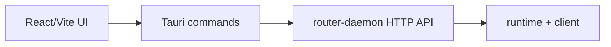

# wechat2all Desktop

macOS-first dashboard for the local wechat2all router.

## What This Package Owns

`packages/desktop` owns the user interface. It should stay thin: render state,
call Tauri commands, and let `router-daemon` / `runtime` own product behavior.

Current screens:

- WeChat connection status and QR login.
- Routes management: cards, selected route detail, and route metadata.
- Agents / MCP connection management.
- Memory, logs, and message trace views.
- Settings, API keys, router endpoint, and autostart placeholders.

## How It Talks To The Rest Of The Project



In Tauri mode, commands in `src-tauri` call the local router daemon configured by
`WECHAT2ALL_ROUTER_DAEMON_URL` or `http://127.0.0.1:39787`.

In browser preview mode, `src/api.ts` returns local fallback data so UI work can
continue without a daemon.

## Tech Stack

- React 19.
- Vite 7.
- Tauri v2.
- Rust Tauri shell with HTTP calls to router-daemon.
- `qrcode` for QR rendering.

## Run

From the repo root:

```bash
pnpm desktop
```

This starts or reuses `@wechat2all/router-daemon`, waits for `/health`, then
starts `tauri dev`.

Run only this package:

```bash
pnpm --filter @wechat2all/desktop dev
```

## Build

```bash
pnpm desktop:build
```

The built macOS app is written to:

```text
packages/desktop/src-tauri/target/release/bundle/macos/wechat2all.app
```

## macOS Permissions

The dashboard itself does not need Accessibility permission. If you use Codex
GUI delivery through the router daemon, the process launching wechat2all must be
enabled in System Settings -> Privacy & Security -> Accessibility.

## Collaborator Notes

- Keep route/business logic out of the UI. Add that to `packages/runtime`.
- Keep daemon lifecycle and HTTP projection in `packages/router-daemon`.
- If the UI cannot reach the daemon, first check `WECHAT2ALL_ROUTER_DAEMON_URL`
  and port `39787`.
