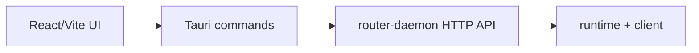

# wechat2all Desktop

macOS-first dashboard for the local wechat2all router.

## What This Package Owns

`packages/desktop` owns the user interface. It should stay thin: render state,
call Tauri commands, and let `router-daemon` / `runtime` own product behavior.

Current screens:

- WeChat connection status and QR login.
- Routes management: cards, selected route detail, and route metadata.
- Community route catalog, installation, updates, removal, and operation progress.
- Memory, logs, and message trace views.
- Settings, API keys, router endpoint, and autostart placeholders.

## How It Talks To The Rest Of The Project



In Tauri mode, commands in `src-tauri` call the local router daemon configured by
`WECHAT2ALL_ROUTER_DAEMON_URL` or `http://127.0.0.1:39787`.

In browser preview mode, `src/api.ts` returns local fallback data so UI work can
continue without a daemon.

## Community Routes

Open **Community** from the primary navigation to see catalog routes and routes
already installed on this Mac. A route card shows its version, permissions, and
runtime or external-app requirements. Install and update actions ask the user to
approve required permissions before they are submitted.
Checksummed managed binaries are listed separately in the confirmation and are
downloaded into the route's private directory; uninstalling the route removes
them as well.

The page is a thin client for the router daemon's generic Community API:

- `GET /community/catalog`
- `GET /community/installed`
- `POST /community/routes/:id/install`
- `POST /community/routes/:id/update`
- `DELETE /community/routes/:id`
- `GET /community/operations/:id`

Install, update, and uninstall operations run asynchronously. The page polls the
returned operation id and reports queued, running, succeeded, or failed status;
failed operations can be retried from the same route card.

## Tech Stack

- React 19.
- Vite 7.
- Tauri v2.
- Rust Tauri shell with HTTP calls to router-daemon.
- `qrcode` for QR rendering.

## Run

From the repo root:

```bash
pnpm desktop
```

This restarts stale local wechat2all dev processes: the desktop app process,
the router port (`39787`), and the UI port (`5173`). Then it starts a fresh
`@wechat2all/router-daemon`, waits for `/health`, and starts `tauri dev`.
On macOS it also runs the Codex GUI auto-open check. The check is disabled by
default and only opens Codex after the user enables `/autoopen 1` inside the
`codex` route.

To opt back into reusing an existing daemon:

```bash
WECHAT2ALL_DESKTOP_RESTART=0 pnpm desktop
```

To skip the Codex GUI auto-open check entirely:

```bash
WECHAT2ALL_DESKTOP_OPEN_CODEX=0 pnpm desktop
```

Run only this package:

```bash
pnpm --filter @wechat2all/desktop dev
```

## Build

```bash
pnpm desktop:build
```

The built macOS app is written to:

```text
packages/desktop/src-tauri/target/release/bundle/macos/wechat2all.app
```

## macOS Permissions

The dashboard itself does not need Accessibility permission. If you use Codex
GUI delivery through the router daemon, the process launching wechat2all must be
enabled in System Settings -> Privacy & Security -> Accessibility.

## Collaborator Notes

- Keep route/business logic out of the UI. Add that to `packages/runtime`.
- Keep daemon lifecycle and HTTP projection in `packages/router-daemon`.
- If the UI cannot reach the daemon, first check `WECHAT2ALL_ROUTER_DAEMON_URL`
  and port `39787`.
